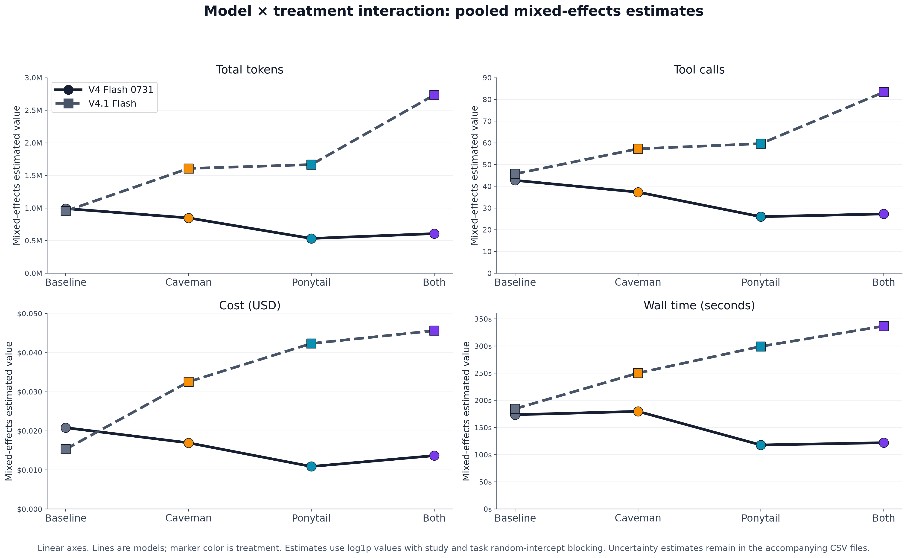
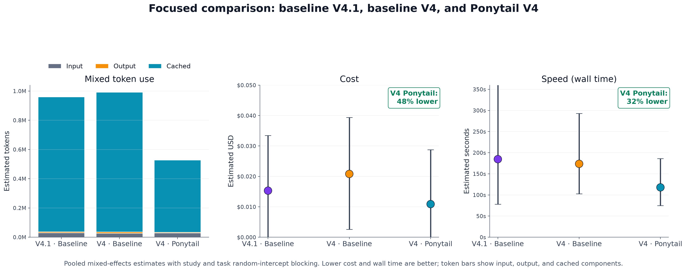
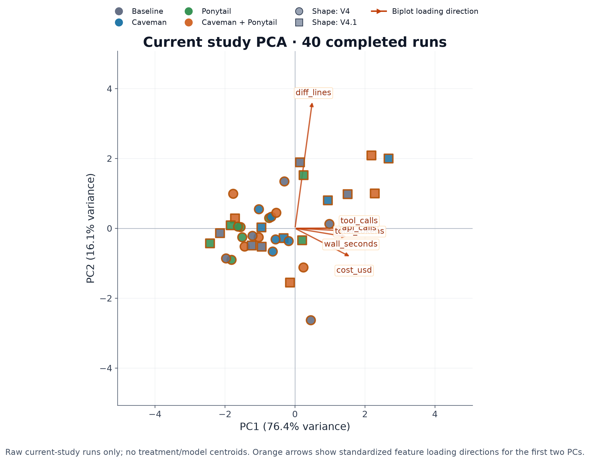
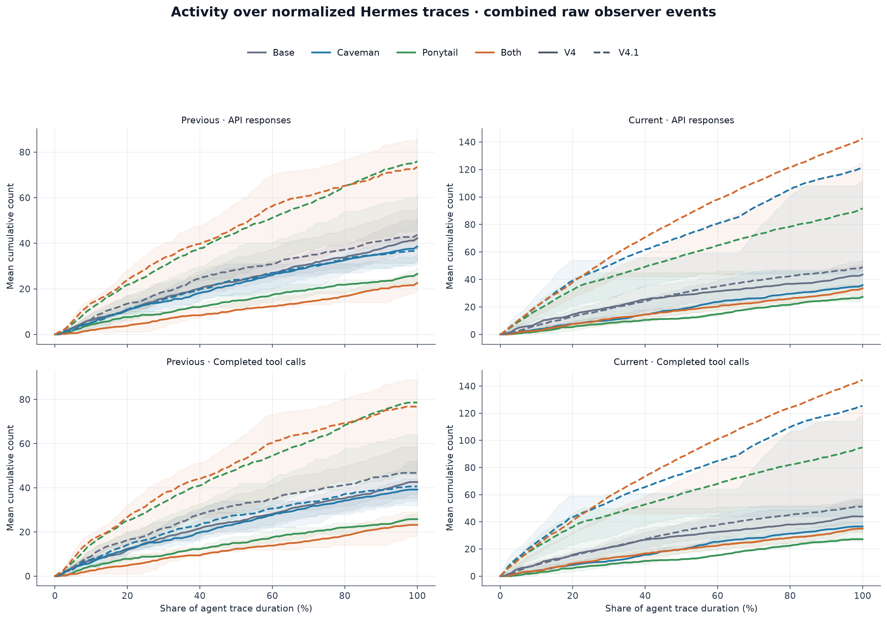

# Forge Bench

Forge Bench is a basic, reproducible tool for comparing AI coding-agent harnesses, models, and providers. It uses experimental design and trace-level data science to understand long-running agent runs: how interventions change behavior, where tokens and time go, and which pain points are worth optimizing.

The project is intended to grow beyond this first study. Future work can add models, providers, tasks, harnesses, and broader execution environments such as Harbor. The goal is to test community assumptions with pinned configurations, raw traces, and analysis code that researchers can inspect, reproduce, and challenge.

## Execution architecture migration

Forge Bench owns the scientific experiment: task selection, factor definitions,
randomized complete blocks, reproducibility metadata, normalized observations,
and statistical analysis. The execution layer is being migrated to
[Harbor](https://www.harborframework.com/) so Harbor can own commodity
task/trial execution, agent installation, sandbox environments, verification,
retries, trajectories, and artifacts.

The Harbor path now treats **agent** and **model** as independent Forge factors.
A baseline design can therefore cross Harbor-native agents such as Hermes, Pi,
OpenCode, or Codex with model identifiers without Forge reimplementing those
agents. Agent-specific options can be carried as opaque `agents[].kwargs`, and
agent version is recorded separately from model identity.

The migration is still staged. The normal `forge-bench` command remains the
legacy Hermes runtime for existing treatment studies. Multi-agent or non-Hermes
designs are planned with `forge-bench --plan-only` and executed through the
opt-in `forge-bench-harbor` path.

Existing Caveman/Ponytail and Forge-controlled budget behavior is preserved only
for Hermes through the existing compatibility specialization. Forge does **not**
port those plugins to other agents in this stage. If a design asks a non-Hermes
agent to participate in a non-baseline treatment or Forge-controlled budget
factor, `harbor_plan.json` is marked non-executable instead of silently
approximating the treatment.

`harbor_plan.json` remains a deterministic projection beside `run_plan.csv`,
preserving exact randomized cells. For baseline Harbor-native agent comparisons,
iteration/budget behavior is currently **agent-default** and is recorded as such;
a later capability-negotiation step is required before turn-budget factors can
be compared fairly across heterogeneous agents.

The target layering is:

```text
Forge Bench
  design / randomization / provenance / analysis
                 |
                 v
              Harbor
  agent x model trials / grading / ATIF / artifacts
          |                     |
      local Docker            Modal
          |
  optional secure capability attachments
  (for example a bounded robot broker)

OpenTelemetry correlation comes later.
Direct LLM/VLM trials are planned as a separate trial kind over the same
local/Modal execution boundary.
```

See [docs/architecture.md](docs/architecture.md) for the ownership boundary and
migration state.

To materialize or execute a Harbor plan during the migration, use the pinned
Harbor version without adding it to the core Forge Bench environment:

```bash
uv run --with harbor==0.23.0 forge-bench-harbor \
  --plan benchmark-results/my-study/harbor_plan.json \
  --trials-dir benchmark-results/my-study/harbor-trials \
  --materialize-only
```

Remove `--materialize-only` only when you intend to run model calls and Harbor
verification.

A no-call agent×model example is provided at
`designs/harbor-agent-model-smoke.yaml`.

### Local Docker and Modal execution

Execution location is deliberately separate from Forge's scientific cell identity.
Changing Docker to Modal does not change `forge_cell_id`, the randomized cell
order, or the source `run_plan_sha256`. The selected execution settings are
written to a sibling `*-execution.json` manifest and Harbor's per-trial config;
normalized Forge results also retain environment and requested CPU/RAM/storage/GPU
resources.

Materialize the local Docker configuration without running anything:

```bash
uv run --with harbor==0.23.0 forge-bench-harbor \
  --plan benchmark-results/my-study/harbor_plan.json \
  --trials-dir benchmark-results/my-study/harbor-trials \
  --environment docker \
  --n-concurrent 4 \
  --materialize-only
```

Run locally after reviewing the materialized configs:

```bash
uv run --with harbor==0.23.0 forge-bench-harbor \
  --plan benchmark-results/my-study/harbor_plan.json \
  --trials-dir benchmark-results/my-study/harbor-trials \
  --environment docker \
  --n-concurrent 4
```

Modal uses the same plan and cell identities:

```bash
uv run --with 'harbor[modal]==0.23.0' forge-bench-harbor \
  --plan benchmark-results/my-study/harbor_plan.json \
  --trials-dir benchmark-results/my-study/harbor-trials-modal \
  --environment modal \
  --n-concurrent 16 \
  --cpus 4 \
  --memory-mb 16384
```

For GPU-backed task environments add, for example, `--gpus 1`. GPU *type*
selection is intentionally deferred to the direct/self-hosted LLM/VLM layer,
where model-runtime requirements can be represented explicitly instead of
overloading coding-agent experiments.

Local execution fails early if the Docker CLI is unavailable. Modal execution
fails early if Harbor's Modal extra is not installed; authentication remains
Modal's normal user/runtime configuration. CI validates Docker/Modal
materialization and resource propagation without provisioning cloud resources or
making paid model calls. A real authenticated Modal smoke test is a separate
provider validation gate.

Concurrency is implemented around Forge's already-materialized explicit Harbor
`TrialConfig` objects. Forge intentionally does not hand its scientific design
to Harbor `JobConfig`, because Harbor's normal job expansion would regenerate
a task × agent Cartesian product rather than consume Forge's exact randomized
cells. Results are returned in authoritative Forge run order even when execution
overlaps.


## Why test token-saving tools?

People want coding agents to finish useful work with fewer tokens, lower cost, and less waiting. [Caveman](https://github.com/JuliusBrussee/caveman/tree/542442bab314973709f95b85b1ac0b3f6f5b5dc6/skills/caveman) asks agents to communicate more directly and avoid unnecessary response tokens. [Ponytail](https://github.com/DietrichGebert/ponytail/tree/e3ba2aa6f1e6f0bc4d69eb09c9f0d0a93af56156) encourages reuse, native features, and the smallest solution that meets the task.

Ponytail explicitly suggests using these approaches together. That creates a reasonable experimental hypothesis: if each intervention reduces work, combining them should deliver additive or compounding savings. Forge Bench was built to test assumptions like this instead of accepting them from a tool description or a single successful run.

## Featured study

This release combines two five-task SWE-bench Verified studies of a last-generation model and its current-generation successor under four harness conditions: Baseline Hermes, Caveman, Ponytail, and Caveman + Ponytail. The release bundle retains run records and raw traces with model, provider, treatment, task, and source-study identity.

> The short preview: the tools do not save work uniformly, their benefits do not reliably add, and the current-generation model is economical at baseline for a reason that is easy to miss from headline token prices.

The complete reproducible data package is in [studies/last-generation-current-generation-tool-interactions](studies/last-generation-current-generation-tool-interactions/).

## The first result: newer is cheaper at baseline; older wins with Ponytail

The current-generation V4.1 baseline is already cost-effective in this cache-heavy workload. Its non-cached tokens cost more, but cache reads are much cheaper, so its baseline cost is lower than the last-generation V4 baseline.

The unexpected result comes when the tools enter: Ponytail lowers V4 token use and tool calls, while V4.1 uses more of both with Ponytail. Caveman + Ponytail also does not show a reliable additive gain. The plot puts that interaction first.



This may reflect a model × tool interaction, provider routing, or differences in trace and task handling. V4 used Relace in both studies; V4.1 used Relace in the earlier study and DeepSeek in the later study. Community validation is requested: can others reproduce the pattern with the same tasks and pinned providers, and can trace inspection explain the model-specific behavior?

## Focused case study: an efficient last-generation configuration

The focused comparison asks how the current-generation baseline compares with the last-generation baseline and the last-generation model plus Ponytail.

- The current-generation baseline is already cost-effective. Its non-cached token prices are higher, but cache reads are much cheaper; this cache-heavy workload makes its baseline cost lower than the last-generation baseline.
- Adding Ponytail to the last-generation model goes further: it costs about **48% less** and takes about **32% less wall time** than the last-generation baseline while using substantially fewer tokens.

The current generation is effective on its own yet less compatible with this intervention. That interaction is more useful than a simple old-versus-new ranking.



### Current-study PCA and raw trace trajectories

PCA uses the current study only, combining models and treatments. Color encodes treatment, point shape encodes model, and orange arrows show the biplot loading directions for standardized features. The trajectory figure is derived from the merged API, tool, and Hermes observer events.





## Experimental design and pooled analysis

The two five-task studies are complementary randomized blocks. We merge their run records and raw traces while retaining study ID, provider, model, treatment, task, and source path for every row.

For interaction and focused comparisons, each usage outcome uses a log1p mixed-effects model with study and task random intercepts, then transforms estimates back to original units. The interaction figure omits intervals for readability; the accompanying CSV files retain estimates and uncertainty.

The model pools descriptive results but cannot separate the V4.1 provider change from the study change, and two study blocks are too few to estimate study-level variation precisely. That limitation is itself a reason to test provider × model and provider × tool interactions directly.

## Install and use Forge Bench

Forge Bench installs as a normal Python package and provides the `forge-bench` command:

```bash
git clone https://github.com/AgenticForge-Labs/forge-bench.git
cd forge-bench
uv sync
uv run forge-bench --check-credentials
```

Plan a design without making model calls, then run it into a named output directory:

```bash
uv run forge-bench --design designs/your-study.yaml --plan-only
uv run forge-bench --design designs/your-study.yaml --output benchmark-results/my-study
```

## Data and reproducibility

The [study package](studies/last-generation-current-generation-tool-interactions/) contains both pinned YAML designs, 80 joined run records, raw merged JSONL traces, source checksums, derived CSV tables, the analysis script, and only the five PNGs shown in this README. It excludes the original 2.6 GB execution workspace, Hermes state databases, evaluation logs, duplicate reports, SVG versions, and unused figures.

Rebuild the tables and figures from the published aggregate data:

```bash
.venv/bin/python studies/last-generation-current-generation-tool-interactions/analysis.py
```

The analysis is descriptive. There is one run per model × treatment × task cell in each study, and the upstream provider changed for V4.1 between studies.
