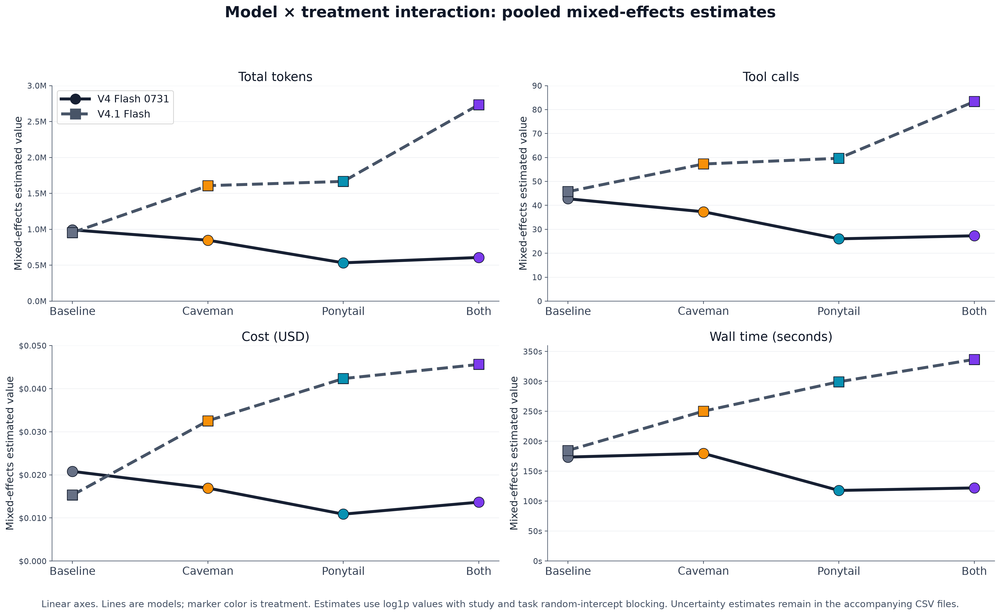
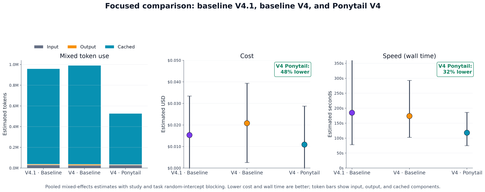
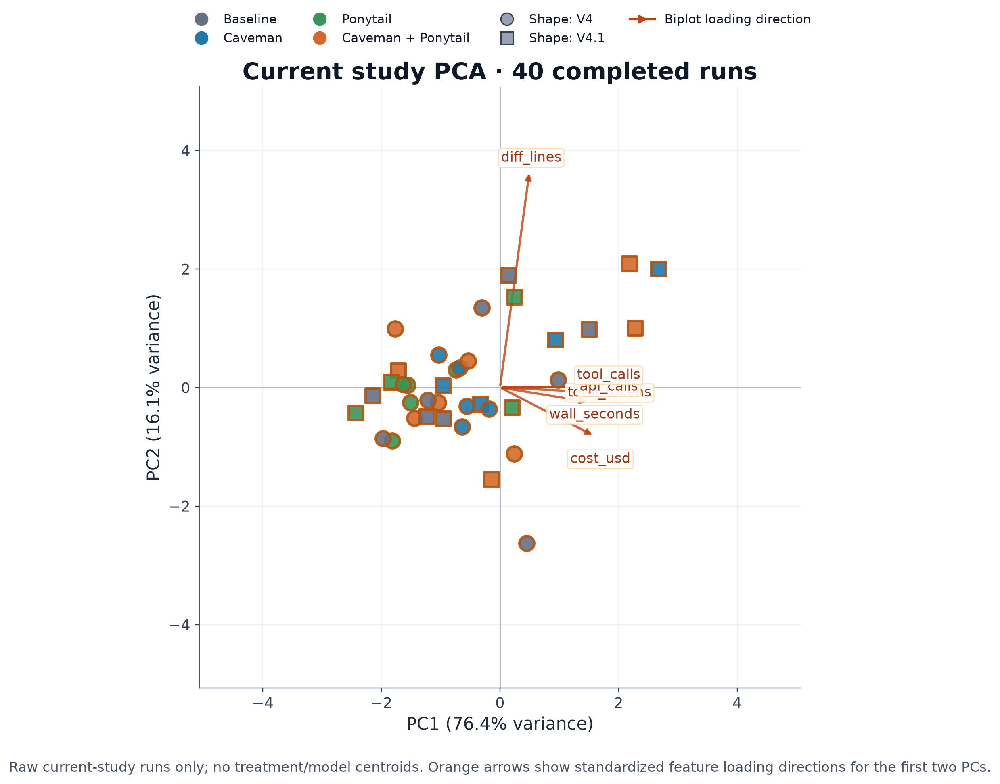
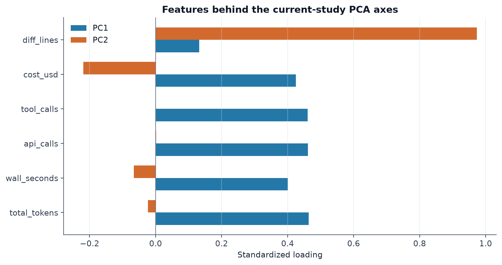
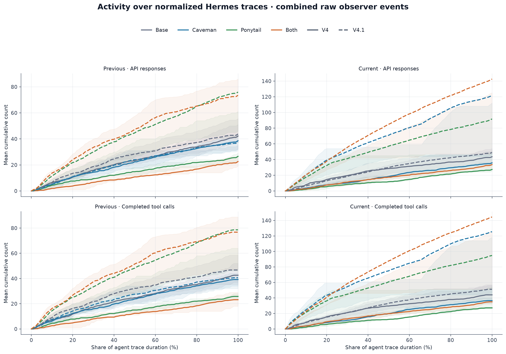

# Forge Bench

Forge Bench is a basic, reproducible tool for comparing AI coding-agent harnesses, models, and providers. It uses experimental design and modern data-science methods to understand long-running agent traces: how interventions change behavior, where tokens and time go, and which pain points are worth optimizing.

The project is meant to grow beyond this first study. Future work can add more models, providers, tasks, harnesses, and broader execution environments such as Harbor. The aim is to test community assumptions with pinned configurations, raw traces, and analysis code that other researchers can inspect, reproduce, and challenge.

## Why test token-saving tools?

People want coding agents to finish useful work with fewer tokens, lower cost, and less waiting. [Caveman](https://github.com/JuliusBrussee/caveman/tree/542442bab314973709f95b85b1ac0b3f6f5b5dc6/skills/caveman) asks agents to communicate more directly and avoid unnecessary response tokens. [Ponytail](https://github.com/DietrichGebert/ponytail/tree/e3ba2aa6f1e6f0bc4d69eb09c9f0d0a93af56156) encourages reuse, native features, and the smallest solution that meets the task.

Ponytail explicitly suggests using these approaches together. That creates a reasonable experimental hypothesis: if each intervention reduces work, combining them should deliver additive or compounding savings. Forge Bench was built to test assumptions like this instead of accepting them from a tool description or a single successful run.

## Featured study

This release combines two five-task SWE-bench Verified studies of a last-generation model and its current-generation successor under four harness conditions: Baseline Hermes, Caveman, Ponytail, and Caveman + Ponytail. The run records and raw traces retain the model, provider, treatment, task, and source-study identity.

> The short preview: the tools do not save work uniformly, their benefits do not reliably add, and the current-generation model is economical at baseline for a reason that is easy to miss from headline token prices. The figures below show the interaction.

## The first result: newer is cheaper at baseline; older wins with Ponytail

The current-generation V4.1 baseline is already cost-effective in this cache-heavy workload. Its non-cached tokens cost more, but cache reads are much cheaper, so its baseline cost is lower than the last-generation V4 baseline.

The unexpected result comes when the tools enter: Ponytail lowers V4 token use and tool calls, while V4.1 uses more of both with Ponytail. Caveman + Ponytail also does not show a reliable additive gain. The plot puts that interaction first.



This may reflect a model × tool interaction, provider routing, or differences in trace and task handling. V4 used Relace in both studies; V4.1 used Relace in the earlier study and DeepSeek in the later study. **Community validation is requested:** can others reproduce the pattern with the same tasks and pinned providers, and can trace inspection explain the model-specific behavior?

## Focused case study: an efficient last-generation configuration

The focused comparison asks how the current-generation baseline compares with the last-generation baseline and the last-generation model plus Ponytail. Two findings matter:

- The current-generation baseline is already cost-effective. Its non-cached token prices are higher, but cache reads are much cheaper; this cache-heavy workload makes its baseline cost lower than the last-generation baseline.
- Adding Ponytail to the last-generation model goes further: it costs about **48% less** and takes about **32% less wall time** than the last-generation baseline while also using substantially fewer tokens.

The current generation therefore looks efficient on its own, yet it does not respond well to the same intervention. That is more informative than a simple old-versus-new ranking.

Three pooled configurations with stacked token components, cost, and wall-clock time.



### Shared PCA

PCA uses the current study only, combining its models and treatments. Color encodes treatment and point shape encodes model. Orange arrows are biplot loading directions for the underlying standardized features; no centroids are shown.





### Raw trace trajectories

These curves are derived from merged `api-events.jsonl`, `tool-events.jsonl`, and `hermes-events.jsonl` observer events. Event times are normalized to the start/end of each Hermes session; curves show mean cumulative completed events with the interquartile range shaded.



## Experimental design and pooled analysis

The two five-task studies are complementary randomized blocks. We merge their run records and raw traces while retaining study ID, provider, model, treatment, task, and source path for every row.

For interaction and focused comparisons, each usage outcome uses a log1p mixed-effects model with study and task random intercepts, then transforms estimates back to original units. The interaction figure omits intervals for readability; the accompanying CSV files retain estimates and uncertainty.

The model pools descriptive results but cannot separate the V4.1 provider change from the study change, and two study blocks are too few to estimate study-level variation precisely. That limitation is itself a reason to test provider × model and provider × tool interactions directly.

## What this study suggests

The results show surprising interactions between models, tools, and providers. Ponytail reduces usage for DeepSeek V4 in this study but does not show the same pattern for V4.1, and the combined Caveman + Ponytail treatment does not reliably add the individual gains. The V4.1 provider change also shows that routing can be part of the behavior being measured. These are starting points for broader community experiments, not universal claims about the tools or models.

## Install and use Forge Bench

Forge Bench installs as a normal Python package and provides the `forge-bench` command:

```bash
git clone https://github.com/AgenticForge-Labs/forge-bench.git
cd forge-bench
uv sync
uv run forge-bench --check-credentials
```

Plan a design without making model calls, then run it into a named output directory:

```bash
uv run forge-bench --design designs/your-study.yaml --plan-only
uv run forge-bench --design designs/your-study.yaml --output benchmark-results/my-study
```

Each output directory contains run metadata, traces, patches, figures, and reports. Analysis scripts can combine studies without discarding model, provider, task, treatment, or source provenance.

## Data and reproducibility

- `combined_runs.json` and `combined_runs.csv`: the 80 joined run records with study, model, treatment, provider, source run ID, validity, and grading fields.
- `traces/`: raw JSONL records from both studies, wrapped with run metadata. Includes Hermes events, API events, tool events, lifecycle events, native Hermes session traces/transcripts, usage, timing summaries, treatment evidence, and model patches.
- `source_trace_manifest.csv`: source paths, byte counts, SHA-256 checksums, and line counts for every merged artifact.
- `combined_pca_*.csv`, `combined_resolution.csv`, `mixed_interaction_estimates.csv`, `focused_configuration_estimates.csv`, `ponytail_effect_pooled_summary.csv`, `ponytail_effect_mixed_summary.csv`, `combined_trace_trajectory_inventory.csv`: plotted scores, loadings, outcomes, pooled effects, and trace coverage.
- `analysis.py`: rebuilds the derived tables and figures directly from this release bundle. If the two original source directories are available locally, it can also rebuild the merged export.

Run from the Forge Bench repository root with Python that has NumPy and Matplotlib installed:

```bash
.venv/bin/python studies/last-generation-current-generation-tool-interactions/analysis.py
```

The analysis is descriptive. There is one run per model × treatment × task cell in each study, and the upstream provider changed for V4.1 between studies.
